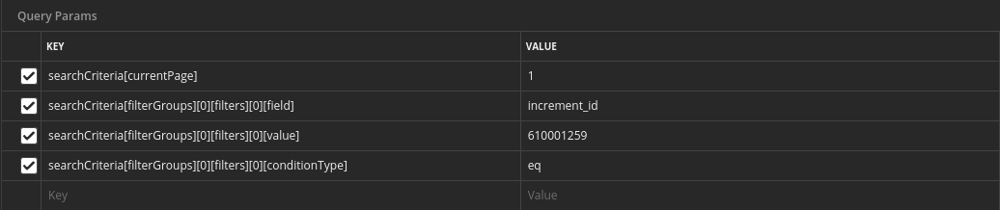

# Enhanced API Search for Magento 2
This module introduces a new way to search in Magento 2 API. Rather than using a querystring, use the body with the JSON format.


## What this module was created for?

A typical search in Magento 2 API is done by putting all the parameters in a querystring, like below:

```bash
curl -X GET https://my-magento2.com/rest/V1/orders/?searchCriteria[currentPage]=1&searchCriteria[filterGroups][0][filters][0][field]=increment_id&searchCriteria[filterGroups][0][filters][0][value]=610001259&searchCriteria[filterGroups][0][filters][0][conditionType]=eq
```

Building this querystring on Postman, is like below:

;

Well, it can confuse a little and, actually, I always forget how to build these parameters.

This module allows you to use the most simplified URL:

```bash
https://my-magento2.com/rest/V1/orders/
```

With the following body parameters:

```json
{
    "searchCriteria": {
        "pageSize": 20,
        "currentPage": 1,
        "filterGroups": [
            {
                "filters": [
                    {
                        "conditionType": "eq",
                        "field": "increment_id",
                        "value": "000000002"
                    }
                ]
            }
        ]
    }
}
```

Simple, right?

## Wait!! Body params in a GET Request?

Yes, I understand this may be a kinda weird, bring some confusion to our heads or even issues with cache systems, for instance, but the module is really simple to not be done. If it fits your needs, feel free to use it without costs.

But if you are very strict with the rules, you don't need to use it.
Reference: https://www.rfc-editor.org/rfc/rfc2616

by MagedIn Technology
